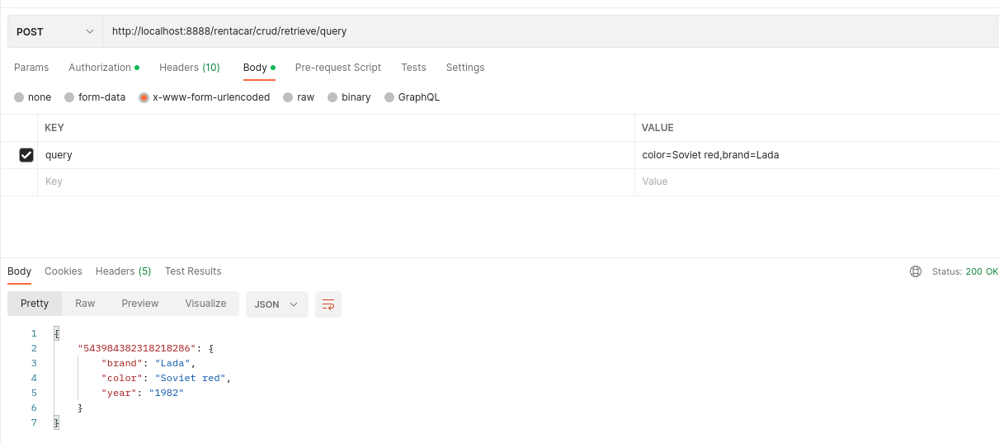
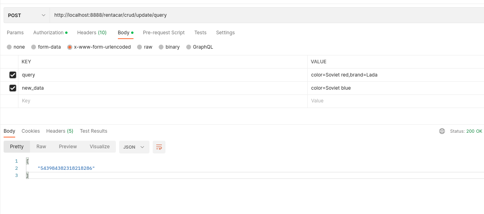
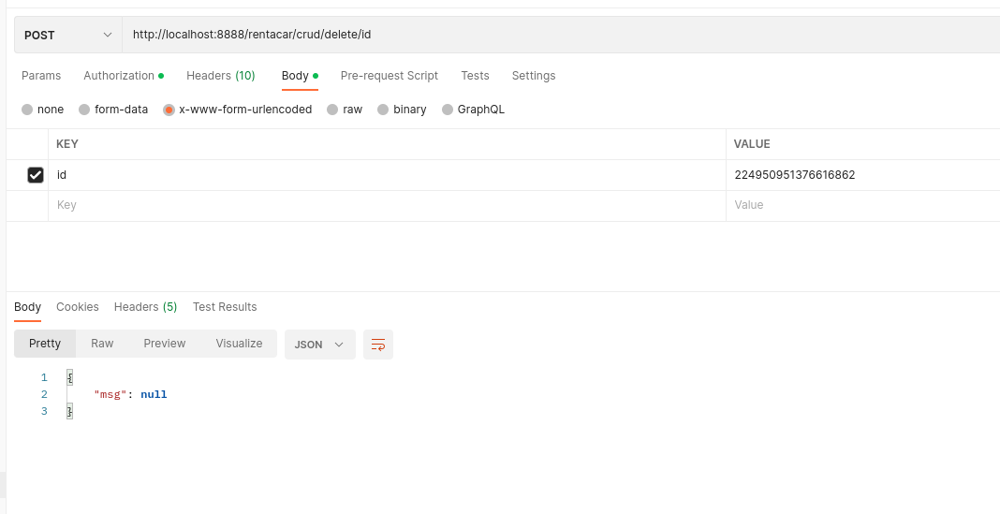

# RENTACAR


Super car management api

## prerequisites

- python3.10+
- Postman ( this document supposes you use Postman)
- install dependencies with `$ pipenv install`
- or `$ pip install -r requirements.txt` if you want to stick with just pip
- Optional: You may need the Postman Agent to overcome CORS restrictions
  - Must be lauched before using Postman

>The agent can be downloaded at **<https://www.postman.com/downloads/postman-agent/>**

### Launch server

1. as vanilla Flask : `python src/rentacar.py [--host/-H '127.0.0.1' --port/-P 8888 --debug/-D]`

2. As WSGI prod server using **Gunicorn** : `gunicorn [--bind 127.0.0.1:8888] rentacar:app`

> see Gunicorn man page for more options

## Usage

### Without Token necessary

#### List available routes


#### Get token


### Set token in Postman


#### Create car into database


#### Retrieve cars

##### all cars


##### retrieve with id


##### retrieve with query



#### Update cars

##### update with id


##### update with query



#### Delete cars

##### delete with id



##### delete with query


##### delete all database (WARNING)


### WARNING

>Before the dataabase purge, you may want to make a copy of it. 

### Add column (field) to the model

The library used to store data enforces the model after the first insertion. 

In order to add a field , just edit the database file

```json
{
    "version": 2,
    "keys": [
        "brand",
        "color",
        "year",
        "category" < # a new field can be added here
    ],
    "data": {
        "543984382318218286": {
            "brand": "Lada",
            "year": "1982",
            "color": "Soviet blue",
            "category": ""
        },
        "176342342618812623": {
            "year": "1978",
            "color": "Metal green",
            "brand": "Moskvitch",
            "category": "Public cars"
        },
        "224950951376616862": {
            "year": "1975",
            "brand": "ZIL-115",
            "color": "Black",
            "category": "Armored vehicle"
        }
    }
}
```

Once added , it can be used into the queries. 


### What is missing

1. The library does not allow the easy update all records at once.
2. A simple migration mechanism to update the database with new fields. 
3. A configuration file. 